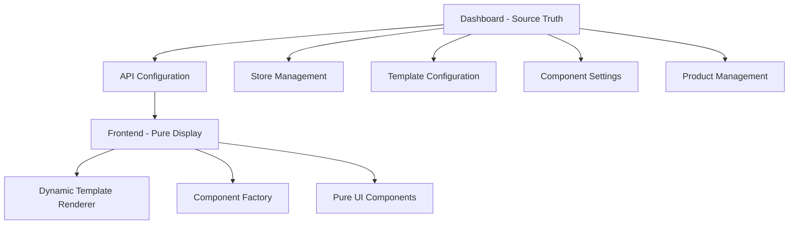

# 🏗️ PLAN DE REFACTORING - ARCHITECTURE STORES & TEMPLATES

## 📊 ÉTAT ACTUEL - PROBLÈMES IDENTIFIÉS

### ❌ **DUPLICATION DE RESPONSABILITÉS**

#### Dans ecomusnext_pro :
```
components/homes/
├── home-1/index.tsx          ❌ Template hardcodé
├── home-4/index.tsx          ❌ Template hardcodé  
├── home-electronic/          ❌ Template hardcodé
└── HomeTemplateBase.tsx      ✅ Bon (factorisation)
```

#### Dans ecomus_dashboard_pro :
```
src/components/stores/        ✅ Gestion des stores
src/app/api/stores/          ✅ APIs stores
src/app/templates/           ❌ Gestion templates (doublon?)
```

### ❌ **LOGIQUE MÉTIER CÔTÉ FRONTEND**
- Templates avec logique hardcodée
- Appels API directs dans les composants
- Gestion des produits/catégories côté frontend

---

## 🎯 ARCHITECTURE CIBLE

### 📐 **PRINCIPE DE SÉPARATION**



### 🔧 **DASHBOARD (ecomus_dashboard_pro) - RESPONSABILITÉS**

#### ✅ CE QUI DOIT RESTER/ÊTRE RENFORCÉ :
```typescript
// 1. GESTION COMPLÈTE DES STORES
interface StoreConfiguration {
  id: string;
  name: string;
  slug: string;
  template: string;           // home-1, home-2, etc.
  theme: {
    colors: object;
    fonts: object;
    layout: object;
  };
  sections: SectionConfig[];  // Configuration dynamique
  seo: object;
  domain: string;
}

// 2. CONFIGURATION DES TEMPLATES
interface TemplateConfiguration {
  id: string;                 // "home-1", "home-2", etc.
  name: string;
  sections: {
    header: ComponentConfig;
    hero: ComponentConfig;
    categories: ComponentConfig;
    products: ComponentConfig;
    footer: ComponentConfig;
  };
}

// 3. CONFIGURATION DES COMPOSANTS
interface ComponentConfig {
  type: string;               // "hero1", "categories", etc.
  props: {
    limit?: number;
    showTitle?: boolean;
    layout?: string;
    [key: string]: any;
  };
  data?: any;                 // Données spécifiques
}
```

#### 🚀 **NOUVELLES APIs À CRÉER/RENFORCER** :
```typescript
// API de configuration complète d'un store
GET /api/stores/[slug]/config
Response: {
  store: StoreConfiguration,
  template: TemplateConfiguration,
  data: {
    products: Product[],
    categories: Category[],
    collections: Collection[]
  }
}

// API de template spécifique
GET /api/templates/[templateId]/config
Response: TemplateConfiguration

// API de données par section
GET /api/stores/[slug]/sections/[sectionId]/data
Response: any (données spécifiques à la section)
```

### 🎨 **ECOMUSNEXT (frontend) - RESPONSABILITÉS**

#### ✅ CE QUI DOIT ÊTRE CONSERVÉ/SIMPLIFIÉ :
```typescript
// 1. COMPOSANTS UI PURS (sans logique métier)
interface PureComponent {
  // Accepte uniquement des props
  // Pas d'appels API internes
  // Pas de logique métier
  // Juste de l'affichage
}

// 2. MOTEUR DE RENDU DYNAMIQUE
class DynamicTemplateRenderer {
  render(storeConfig: StoreConfiguration) {
    // Rend le template selon la configuration
    // Utilise FactorizedComponents.tsx
  }
}

// 3. FACTORY DE COMPOSANTS
const ComponentFactory = {
  create(config: ComponentConfig) {
    // Crée le composant selon le type et les props
    return getComponent(config.type, config.props);
  }
}
```

#### ❌ **CE QUI DOIT ÊTRE SUPPRIMÉ** :
```typescript
// 1. Templates hardcodés
❌ components/homes/home-1/index.tsx
❌ components/homes/home-4/index.tsx
❌ components/homes/home-electronic/index.tsx

// 2. Logique métier dans les composants
❌ ProductsAPI.tsx (logique d'API)
❌ Appels fetch() dans les composants
❌ Gestion des états métier

// 3. Données hardcodées
❌ data/categories.js
❌ data/products.js
❌ Toutes les données statiques
```

---

## 🔄 PLAN DE MIGRATION

### 📅 **ÉTAPE 1 : AUDIT ET NETTOYAGE**
- [ ] Identifier tous les doublons de logique
- [ ] Lister les APIs existantes dans les deux projets
- [ ] Mapper les responsabilités actuelles

### 📅 **ÉTAPE 2 : RENFORCEMENT DU DASHBOARD**
- [ ] Créer les APIs de configuration complète
- [ ] Migrer toute la logique métier vers le dashboard
- [ ] Tester les APIs de configuration

### 📅 **ÉTAPE 3 : SIMPLIFICATION DU FRONTEND**
- [ ] Refactoriser les composants en composants purs
- [ ] Créer le moteur de rendu dynamique
- [ ] Supprimer les templates hardcodés
- [ ] Supprimer les données statiques

### 📅 **ÉTAPE 4 : TESTS ET VALIDATION**
- [ ] Tester le rendu dynamique
- [ ] Valider que tout fonctionne via le dashboard
- [ ] Performance et optimisations

---

## 🎯 RÉSULTAT ATTENDU

### ✅ **APRÈS LE REFACTORING** :

#### Dashboard devient la SOURCE UNIQUE :
```typescript
// Tout est géré depuis le dashboard
const store = dashboard.stores.create({
  template: "home-1",
  sections: {
    hero: { type: "hero1", props: { title: "..." } },
    categories: { type: "categories", props: { limit: 6 } }
  }
});
```

#### Frontend devient un MOTEUR D'AFFICHAGE :
```typescript
// Frontend récupère et affiche
const config = await fetch(`/api/stores/${slug}/config`);
return <DynamicTemplate config={config} />;
```

### 🚀 **AVANTAGES** :
- ✅ **Une seule source de vérité** (dashboard)
- ✅ **Pas de duplication** de code/logique
- ✅ **Modification en temps réel** via dashboard
- ✅ **Scalabilité** : nouveaux templates sans code
- ✅ **Maintenance** simplifiée
- ✅ **Performance** : frontend léger

---

## 🔧 ACTIONS IMMÉDIATES RECOMMANDÉES

### 1. **AUDIT COMPLET**
```bash
# Analyser les doublons
find . -name "*.tsx" -o -name "*.jsx" | xargs grep -l "fetch\|api\|useState"
```

### 2. **CRÉER L'API DE CONFIGURATION**
```typescript
// Dans ecomus_dashboard_pro
src/app/api/stores/[slug]/config/route.ts
```

### 3. **REFACTORISER LES COMPOSANTS**
```typescript
// Transformer tous les composants en composants purs
// Supprimer toute logique métier
```

### 4. **CRÉER LE MOTEUR DYNAMIQUE**
```typescript
// Dans ecomusnext_pro
components/DynamicTemplateRenderer.tsx
```

---

*Cette architecture respecte le principe de séparation des responsabilités et élimine toutes les incohérences identifiées.*