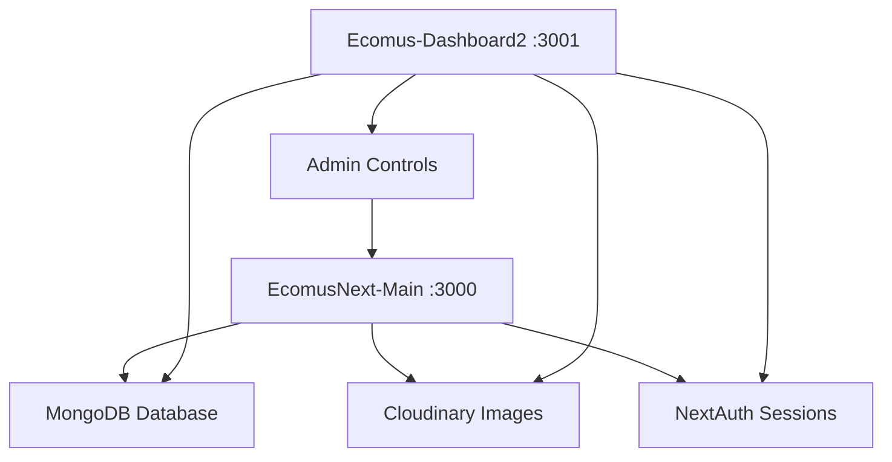

# 📊 RÉSUMÉ COMPLET DES APPLICATIONS ECOMUS

## 🏗️ ARCHITECTURE GÉNÉRALE

Ce projet est composé de **deux applications Next.js distinctes** mais interconnectées :

### 1. **EcomusNext-Main** (Application E-commerce Frontend)
- **Nom technique** : `ecoums-next`
- **Version** : 0.1.1
- **Port** : 3000
- **Rôle** : Boutique en ligne publique

### 2. **Ecomus-Dashboard2** (Application Dashboard Administratif)
- **Nom technique** : `hope-ui-ecommerce-nextjs`
- **Version** : 1.0.0
- **Port** : 3001
- **Rôle** : Tableau de bord administratif

---

## 🛍️ ECOMUSNEXT-MAIN : BOUTIQUE E-COMMERCE

### **Description**
Application e-commerce moderne construite avec Next.js 15, offrant une expérience d'achat complète avec interface utilisateur responsive et fonctionnalités avancées.

### **Technologies Principales**
- **Framework** : Next.js 15.3.4
- **React** : 19.0.0
- **Base de données** : MongoDB avec Mongoose 8.15.1
- **Authentification** : NextAuth.js 4.24.11
- **Styling** : Sass 1.77.8 + Bootstrap 5.3.2
- **Images** : Cloudinary 2.7.0 + Unsplash
- **Paiements** : Intégration prévue
- **Animations** : Framer Motion 11.15.0
- **3D** : Three.js 0.163.0
- **Carrousels** : Swiper 11.1.11

### **Fonctionnalités Clés**
#### **🎯 Boutique en ligne**
- ✅ Catalogue produits avec filtrage et recherche
- ✅ Panier d'achat avec gestion des quantités
- ✅ Wishlist et favoris
- ✅ Système de notes et avis clients
- ✅ Lookbooks et inspiration shopping
- ✅ Comparaison de produits
- ✅ Zoom sur images produits

#### **👤 Gestion utilisateurs**
- ✅ Inscription/Connexion avec NextAuth
- ✅ Profils utilisateurs
- ✅ Historique des commandes
- ✅ Adresses de livraison

#### **🛒 Expérience d'achat**
- ✅ Processus de commande fluide
- ✅ Gestion des stocks en temps réel
- ✅ Notifications toast pour les actions
- ✅ Interface responsive mobile/desktop

#### **📦 Fonctionnalités avancées**
- ✅ Internationalisation (i18n)
- ✅ Mode sombre/clair
- ✅ PWA (Progressive Web App)
- ✅ SEO optimisé
- ✅ Intégration Socket.io pour temps réel

### **Scripts de Développement**
```bash
# Développement
npm run dev

# Base de données
npm run seed            # Peuplement complet
npm run seed:cloudinary # Images Cloudinary
npm run create:admin    # Création admin

# Tests
npm run test           # Suite de tests
npm run test:security  # Tests sécurité

# Intelligence artificielle
npm run setup:ollama   # Configuration IA
npm run test:ai        # Tests services IA
```

---

## 🎛️ ECOMUS-DASHBOARD2 : TABLEAU DE BORD ADMINISTRATIF

### **Description**
Tableau de bord administratif ultra-complet basé sur Hope UI Pro, offrant une interface de gestion avancée pour l'écosystème e-commerce avec système multi-rôles et multi-boutiques.

### **Technologies Principales**
- **Framework** : Next.js 15.1.2
- **React** : 18.2.0
- **TypeScript** : 5.8.3
- **Base de données** : Mongoose 8.15.1
- **Authentification** : NextAuth.js 4.24.11
- **UI Framework** : Radix UI + Tailwind CSS 3.3.0
- **Animations** : Framer Motion 10.16.0
- **Graphiques** : Chart.js 4.4.0 + Recharts 2.15.3
- **3D** : Three.js 0.177.0 + React Three Fiber
- **Gestion d'état** : Zustand 4.4.0

### **Fonctionnalités Clés**

#### **🎯 Système Multi-Rôles**
- ✅ **Admin** : Contrôle total du système
- ✅ **Vendor** : Gestion de boutique individuelle
- ✅ **Customer** : Dashboard personnel
- ✅ Permissions granulaires (11+ permissions)
- ✅ Protection des routes par middleware

#### **📊 Dashboard Admin Ultra-Complet**
- ✅ Analytics avancées (ventes, revenus, croissance)
- ✅ Gestion utilisateurs avec CRUD complet
- ✅ Gestion des rôles et permissions
- ✅ Vue globale multi-boutiques
- ✅ Modération des contenus
- ✅ Système de tickets et support
- ✅ Gestion des remboursements
- ✅ Paramètres système globaux

#### **🏪 Dashboard Vendeur**
- ✅ Gestion de boutique personnalisée
- ✅ CRUD produits avec upload d'images
- ✅ Gestion des commandes et stocks
- ✅ Analytics de performance
- ✅ Intégration Stripe Connect
- ✅ Gestion des payouts
- ✅ Système de templates de boutique

#### **👤 Dashboard Utilisateur**
- ✅ Profil personnel avancé
- ✅ Historique des commandes
- ✅ Suivi des vendeurs favoris
- ✅ Gestion des adresses
- ✅ Wishlist et favoris
- ✅ Notifications personnalisées

#### **🔧 Fonctionnalités Avancées**
- ✅ Thèmes dynamiques et customisation
- ✅ Système de templates de boutique
- ✅ Gamification avec badges
- ✅ Notifications temps réel
- ✅ Export CSV et logs d'audit
- ✅ Système de sauvegarde médias
- ✅ Intégration complète Cloudinary

### **Scripts de Développement**
```bash
# Développement
npm run dev

# Base de données
npm run init:roles      # Initialisation rôles
npm run setup:db       # Configuration DB
npm run setup:complete # Configuration complète

# SEO
npm run seo:generate-slugs  # Génération slugs
npm run seo:auto-metadata  # Métadonnées auto
npm run seo:setup         # Configuration SEO complète

# Tests
npm run test:api       # Tests API
```

---

## 🔗 RAPPORT ENTRE LES APPLICATIONS

### **Architecture Interconnectée**



### **Base de Données Partagée**
- **MongoDB unique** : Les deux applications utilisent la même base de données
- **Synchronisation temps réel** : Les modifications du dashboard se reflètent instantanément dans la boutique
- **Modèles partagés** : User, Product, Order, Store, etc.
- **Isolation multi-tenant** : Chaque vendeur a ses données isolées

### **Système d'Authentification Unifié**
- **NextAuth.js** : Même système d'authentification
- **JWT partagé** : Tokens valides sur les deux applications
- **Sessions unifiées** : Connexion unique pour les deux interfaces

### **Gestion des Médias Centralisée**
- **Cloudinary** : Même compte pour les deux applications
- **URLs partagées** : Images accessibles depuis les deux plateformes
- **Optimisation** : Images optimisées automatiquement

### **Flux de Données**

#### **📝 Gestion des Produits**
1. **Création** : Vendeur crée produit dans Dashboard2
2. **Validation** : Admin valide via Dashboard2
3. **Publication** : Produit apparaît dans EcomusNext-Main
4. **Commande** : Client commande via EcomusNext-Main
5. **Gestion** : Vendeur gère la commande via Dashboard2

#### **👥 Gestion des Utilisateurs**
1. **Inscription** : Possible depuis les deux applications
2. **Rôles** : Assignés via Dashboard2
3. **Permissions** : Contrôlées par le système de rôles
4. **Données** : Synchronisées automatiquement

### **Avantages de cette Architecture**

#### **🔄 Séparation des Responsabilités**
- **Frontend** : EcomusNext-Main se concentre sur l'UX client
- **Backend** : Dashboard2 gère l'administration
- **Performance** : Chaque app optimisée pour son usage

#### **🛡️ Sécurité Renforcée**
- **Isolation** : Interface admin séparée
- **Contrôle d'accès** : Permissions granulaires
- **Audit** : Traçabilité complète des actions

#### **📈 Scalabilité**
- **Déploiement indépendant** : Chaque app peut être déployée séparément
- **Load balancing** : Répartition de charge possible
- **Microservices** : Architecture modulaire

#### **🔧 Maintenance Facilité**
- **Développement parallèle** : Équipes peuvent travailler indépendamment
- **Tests isolés** : Tests spécifiques par application
- **Mises à jour** : Déploiement progressif possible

---

## 🎯 CONCLUSION

Cette architecture **dual-app** offre une solution e-commerce complète et professionnelle :

- **EcomusNext-Main** : Interface client optimisée pour les ventes
- **Ecomus-Dashboard2** : Outil d'administration puissant et complet

L'interconnexion via MongoDB et NextAuth assure une **cohérence des données** et une **expérience utilisateur fluide** tout en maintenant la **sécurité** et la **performance** de chaque application.

Ce système est prêt pour un **déploiement professionnel** avec toutes les fonctionnalités modernes attendues d'une plateforme e-commerce enterprise.
